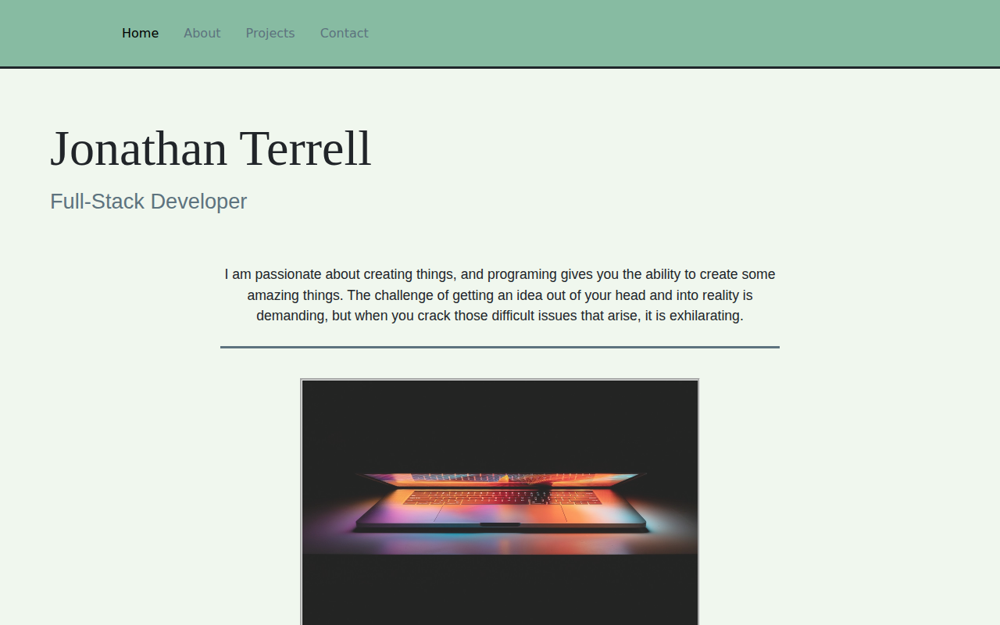

# Portfolio

Personal portfolio site — home, about, projects, and contact — built as a single-page React app.



## Features
- Project showcase with embedded video walkthroughs (react-player)
- Contact form wired to EmailJS — messages arrive by email with no backend server
- Styled with Material-UI, Bootstrap, and styled-components

## Stack
React (Create React App) · Redux + redux-thunk · React Router · Material-UI · styled-components · EmailJS

## Run locally

```bash
npm install --legacy-peer-deps
npm start
```

Built at devCodeCamp (2021).
